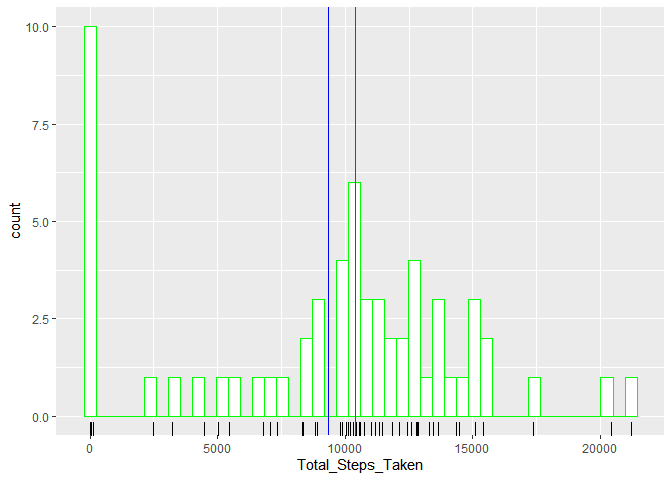
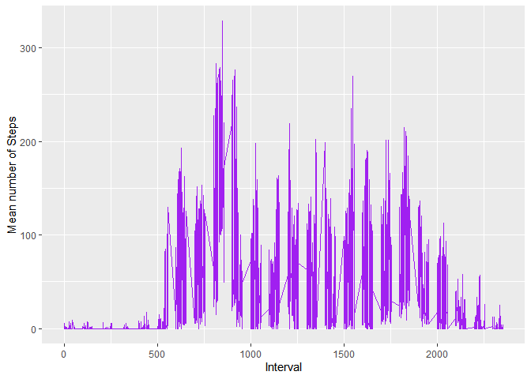
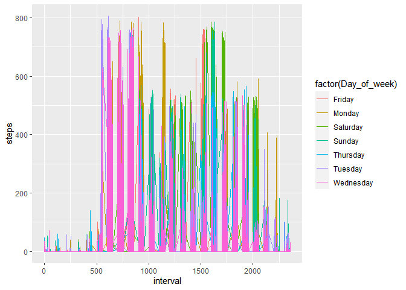
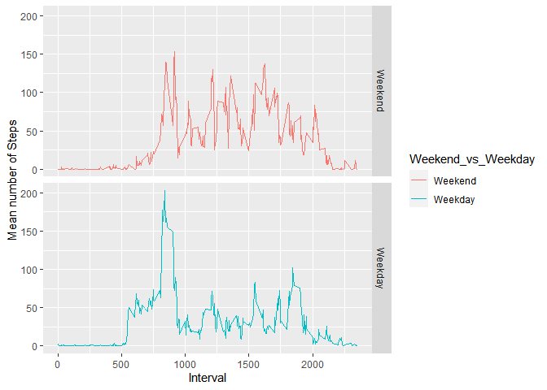

Untitled
================

The first step in this assignment was to unzip and read in the .csv file
and unzip file and read it into a dataframe

``` r
knitr::opts_chunk$set(message = TRUE, warning = TRUE)
require("knitr")
```

    ## Loading required package: knitr

``` r
library(knitr)
#if the proceeding libraries are not installed to your device uncomment the next thre lines.
#install.packages("tidyverse)
#install.packages("data.table")
#install.packages("curl")
library(tidyverse)
```

    ## -- Attaching packages --------------------------------------------------------------------------- tidyverse 1.3.0 --

    ## v ggplot2 3.3.0     v purrr   0.3.3
    ## v tibble  2.1.3     v dplyr   0.8.4
    ## v tidyr   1.0.2     v stringr 1.4.0
    ## v readr   1.3.1     v forcats 0.5.0

    ## -- Conflicts ------------------------------------------------------------------------------ tidyverse_conflicts() --
    ## x dplyr::filter() masks stats::filter()
    ## x dplyr::lag()    masks stats::lag()

``` r
library(data.table)
```

    ## 
    ## Attaching package: 'data.table'

    ## The following objects are masked from 'package:dplyr':
    ## 
    ##     between, first, last

    ## The following object is masked from 'package:purrr':
    ## 
    ##     transpose

``` r
library(curl)
```

    ## 
    ## Attaching package: 'curl'

    ## The following object is masked from 'package:readr':
    ## 
    ##     parse_date

``` r
library(utils)
##Downloads the zip file and unzips it
#setwd("./RepData_PeerAssessment1/")
#knit2html("report.Rmd", "report.html")
if(!dir.exists("./RepData_PeerAssessment1")){dir.create("./RepData_PeerAssessment1")}
#Here are the data for the project:

if(!file.exists("activity.csv")){unzip(zipfile="./RepData_PeerAssessment1/activity.zip",exdir="./RepData_PeerAssessment1")}
```

``` r
Activity_data <- read.csv("activity.csv", header=TRUE)
Activity_dim <-dim(Activity_data)
Activity_data_NA_count <-Activity_data%>%
  summarize(sum(is.na(steps)))
```

There are currently 17568 observations and 3 variables with 2304 missing
variables.

So the first question is what is mean per day ? To Answer this question
first we have to insert the days for the week into the dataframe. We
will call this variable `Day_of_week` and use a lubridate function that
is available in the tidyverse package. If you are not familiar with this
package I would highly recommend familiarizing yourself with it.

``` r
Activity_data<-Activity_data%>%
    mutate(date=(as.Date(as.POSIXct( paste(date),format="%Y-%m-%d", tz="GMT"))))
Activity_data$Day_of_week <-as.factor(weekdays(as.Date(Activity_data$date)))
```

Did this work? Let us check:

``` r
head(Activity_data)
```

    ##   steps       date interval Day_of_week
    ## 1    NA 2012-10-01        0      Monday
    ## 2    NA 2012-10-01        5      Monday
    ## 3    NA 2012-10-01       10      Monday
    ## 4    NA 2012-10-01       15      Monday
    ## 5    NA 2012-10-01       20      Monday
    ## 6    NA 2012-10-01       25      Monday

Now we need to evaluate the mean of the steps by day of the week. This
can be performed with `mutate`, `summary` and \`mean’

``` r
Activity_data<-data.frame(Activity_data)
Summary_by_Day <-Activity_data%>%
  group_by(Day_of_week)%>%
  summarize(Mean_of_steps=(mean(na.omit(steps))))

Summary_by_Day <-data.frame(Summary_by_Day)
```

What was the output? Let’s print it.

``` r
print(Summary_by_Day)
```

    ##   Day_of_week Mean_of_steps
    ## 1      Friday      42.91567
    ## 2      Monday      34.63492
    ## 3    Saturday      43.52579
    ## 4      Sunday      42.63095
    ## 5    Thursday      28.51649
    ## 6     Tuesday      31.07485
    ## 7   Wednesday      40.94010

Ugh\! What is with the Days of the week? Oh Friday is the most steps. We
can sort it by day to give use an idea from the begining of the week how
many and how it changes over the days. To do this we will have to assign
levels to the days of the weeks. I will start with Monday as the first
day of the week and go from there, Monday\>Tuesday\>…\>Sunday. And what
is with those significant figures, lets change that to only 3. We will
change the significant figures by using `digits` in the options of the
Base R package.

``` r
options(pillar.sigfig=3)

  Summary_by_Day$Day_of_week <- factor(Summary_by_Day$Day_of_week, levels= c("Monday", 
    "Tuesday", "Wednesday", "Thursday", "Friday", "Saturday", "Sunday"))
 Summary_by_Day_v2<- Summary_by_Day[order(Summary_by_Day$Day_of_week),]
 Summary_by_Day_v2 <-data.frame(Summary_by_Day_v2)
 options(digits = 3)
 print(Summary_by_Day_v2) 
```

    ##   Day_of_week Mean_of_steps
    ## 2      Monday          34.6
    ## 6     Tuesday          31.1
    ## 7   Wednesday          40.9
    ## 5    Thursday          28.5
    ## 1      Friday          42.9
    ## 3    Saturday          43.5
    ## 4      Sunday          42.6

### What are the total number of steps per day? This is a different question from the mean on each day, so we will group `steps` by `Date`.

``` r
Summary_by_Date <-Activity_data%>%
  group_by(date)%>%
  summarize("Total_Steps_Taken"=sum(na.omit(steps)))
head(Summary_by_Date)
```

    ## # A tibble: 6 x 2
    ##   date       Total_Steps_Taken
    ##   <date>                 <int>
    ## 1 2012-10-01                 0
    ## 2 2012-10-02               126
    ## 3 2012-10-03             11352
    ## 4 2012-10-04             12116
    ## 5 2012-10-05             13294
    ## 6 2012-10-06             15420

### Make a histogram of the total number of steps taken each day.

For what it is worth the differences between a histogram is based on the
frequency that an event has occured making it a statistical graph;
whereas, a barchart is simply a visualization or graph of the x and y
components, (`Date` vs `Total_Steps_Taken` in our case). Before we
contruct the histogram there is one important question that needs be
answered. I don’t like assigning values arbitrarily, so I investigated.
*How to determine many breaks do we set?* The number of breaks will be
assigned by R if we do not use the `breaks=` function. To make a good
estimation we should have some background knowledge. We are going to use
the The Freedman-Diaconis rule\[1\] instead of Sturge’s Rule. The
bin-width is set to h=2×IQR×n^−1/3. So the number of bins is
(max−min)/h, where n is the number of observations, max is the maximum
value and min is the minimum value.IQR stands for the interquantile
range, basically -1 standard deviation to 1 Standard Deviation in
length:

``` r
Steps_IQR <-IQR(Summary_by_Date$Total_Steps_Taken)
h= 2*(Steps_IQR)*(Activity_dim[1])^(-1/3)
max_steps <-as.numeric(max(Summary_by_Date$Total_Steps_Taken, remove.na=TRUE))
min_steps <-as.numeric(min(Summary_by_Date$Total_Steps_Taken, remove.na=TRUE))
number_of_bins <-((max_steps-min_steps)/h)

mean_steps <-mean(Summary_by_Date$Total_Steps_Taken, remove.na=TRUE)

median_steps <-median(Summary_by_Date$Total_Steps_Taken, remove.na=TRUE)
```

The IQR for our data is 6033 and the number of observations n=17568, so
that the h of the bin-width is 464.147, the minimun number of steps is 0
and the Max number of steps is 2.11910^{4}, finally we arive at the
number of bins 45.662, but we will round to 46.

I am also going to add in the median(10395) in red and the mean(9354.23)
in blue to this graph.

``` r
p<-ggplot(Summary_by_Date, aes(x=Total_Steps_Taken))+ geom_histogram(bins = 46, color="green",fill="white")

p+geom_rug()+geom_vline(aes(xintercept=mean_steps), color="blue")+geom_vline(aes(xintercept=median_steps), color="red")
```

<!-- -->
\#\#\#Calculate and report the mean and median of the total number of
steps taken per day

``` r
Activity_data_means<-Activity_data%>%
  group_by(Day_of_week)%>%
  summarize("Mean_by_Day"=mean(na.omit(steps)))
  Activity_data_means$Day_of_week <- factor(Activity_data_means$Day_of_week, levels= c("Monday", 
    "Tuesday", "Wednesday", "Thursday", "Friday", "Saturday", "Sunday"))
Activity_data_means<- Summary_by_Day[order(Activity_data_means$Day_of_week),]
print(Activity_data_means)
```

    ##   Day_of_week Mean_of_steps
    ## 2      Monday          34.6
    ## 6     Tuesday          31.1
    ## 7   Wednesday          40.9
    ## 5    Thursday          28.5
    ## 1      Friday          42.9
    ## 3    Saturday          43.5
    ## 4      Sunday          42.6

``` r
Activity_data_median<-Activity_data%>%
  group_by(Day_of_week)%>%  
  summarize("Median_by_Day"=median(na.omit(steps)))
print(Activity_data_median)
```

    ## # A tibble: 7 x 2
    ##   Day_of_week Median_by_Day
    ##   <fct>               <dbl>
    ## 1 Friday                  0
    ## 2 Monday                  0
    ## 3 Saturday                0
    ## 4 Sunday                  0
    ## 5 Thursday                0
    ## 6 Tuesday                 0
    ## 7 Wednesday               0

### Make a time series plot of the 5-minute interval (x-axis) and the average number of steps taken, averaged across all days (y-axis). To answer this question first we will need to group `steps` by `Day_of_week` and `interval`.

``` r
Average_Number_of_steps_by_interval<-Activity_data%>%
  group_by(Day_of_week, interval)%>%
  summarize(Mean_by_interval= mean(na.omit(steps)))
head(Average_Number_of_steps_by_interval)
```

    ## # A tibble: 6 x 3
    ## # Groups:   Day_of_week [1]
    ##   Day_of_week interval Mean_by_interval
    ##   <fct>          <int>            <dbl>
    ## 1 Friday             0                0
    ## 2 Friday             5                0
    ## 3 Friday            10                0
    ## 4 Friday            15                0
    ## 5 Friday            20                0
    ## 6 Friday            25                0

Then we will plot the interval on the x-axis and steps on the y axis

``` r
Steps_over_interval<-ggplot(Average_Number_of_steps_by_interval, aes(x=interval,y= Mean_by_interval))+
  geom_line(col="purple")
  #geom_point(data=Max_number_of_steps, aes(interval, Max_steps, na.omit=TRUE))

Steps_over_interval+labs(x="Interval", y="Mean number of Steps")
```

<!-- -->

``` r
Max_number_of_steps<-Activity_data%>%
  group_by(Day_of_week)%>%
  slice(which.max(steps))%>%
  select(Day_of_week,interval,steps)
print(Max_number_of_steps)
```

    ## # A tibble: 7 x 3
    ## # Groups:   Day_of_week [7]
    ##   Day_of_week interval steps
    ##   <fct>          <int> <int>
    ## 1 Friday           900   802
    ## 2 Monday           720   789
    ## 3 Saturday        1600   785
    ## 4 Sunday          1635   785
    ## 5 Thursday         815   759
    ## 6 Tuesday          615   806
    ## 7 Wednesday        850   766

### Imputing missing values

“Note that there are a number of days/intervals where there are missing
values (coded as NA). The presence of missing days may introduce bias
into some calculations or summaries of the data.” Perhaps it will
introduce bias into some of the calculations. However, a person is not
up 24 hours a day most Americans sleep anywhere from 6 to 8 a night,
some nights less some nights more. Because we do not know the exact time
frame on any given day when these NA occur we will need to graph the
interval of each date on the x-axis and number of steps on the y-axis.
Then check the gaps. If the gaps are at a consistant interval period
then its most likely that the person sleeps at this time. But first lets
see how many NA’s are in the data set.

``` r
how_many_NAs <-Activity_data%>%
  summarize(sum(is.na(steps)))
```

So, there are 2304NAs in this data set.Is that alot or alittle? We have
no frame of reference. So lets plot the data by `Day` and see how what
width of space it gives us.

``` r
q <-ggplot(Activity_data, aes(x=interval, y=steps, na.rm=TRUE))
q+geom_line(aes(color=factor(Day_of_week)))
```

    ## Warning: Removed 3 row(s) containing missing values (geom_path).

<!-- -->

So, everyday for from 0 to 475 minutes there is no data. I wonder how
many hours that is.

``` r
number_of_hours <-475/60
```

The output was 7.917 in all the NAs observations and plot it.

``` r
Activity_data$steps[is.na(Activity_data$steps)]<-0
Activity_data_without_NAs <-data.frame(Activity_data)
```

``` r
q <-ggplot(Activity_data, aes(x=interval, y=steps, na.rm=TRUE))
q+geom_line(aes(color=factor(Day_of_week)))
```

<!-- -->

Normally, I don’t have a problem filling in missing data, and I think
its important to filling in missing data if the cause for its asbence is
known. But this demonstrates that at a certain part of day there is no
data, most likely sleeping, and getting up to use the bathroom, a drink
of water, or other noctirnal activities. BUT, I will devise a strategy
to address this. In this scenerio, I filled the NAs with 0’s.

However, leaving the data blank is not optional.

The strategy does not need to be sophisticated. Create a new dataset
that is equal to the original dataset but with the missing data filled
in.

``` r
Activity_data_without_NAs<-data.frame(Activity_data)
head(Activity_data_without_NAs)
```

    ##   steps       date interval Day_of_week
    ## 1     0 2012-10-01        0      Monday
    ## 2     0 2012-10-01        5      Monday
    ## 3     0 2012-10-01       10      Monday
    ## 4     0 2012-10-01       15      Monday
    ## 5     0 2012-10-01       20      Monday
    ## 6     0 2012-10-01       25      Monday

Make a histogram of the total number of steps taken each day and
Calculate and report the mean and median total number of steps taken per
day. Do these values differ from the estimates from the first part of
the assignment? What is the impact of imputing missing data on the
estimates of the total daily number of steps?

``` r
Activity_data_without_NAs$Day_of_week<-factor(Activity_data_without_NAs$Day_of_week, levels= c("Monday", 
    "Tuesday", "Wednesday", "Thursday", "Friday", "Saturday", "Sunday"))
Activity_data_without_NAs_means <-Activity_data_without_NAs%>%
  group_by(Day_of_week)%>%
  summarize("New_Mean"=mean(steps))
Activity_data_without_NAs_means<-Activity_data_without_NAs_means[order(Activity_data_without_NAs_means$Day_of_week),]

print(Activity_data_without_NAs_means)
```

    ## # A tibble: 7 x 2
    ##   Day_of_week New_Mean
    ##   <fct>          <dbl>
    ## 1 Monday          26.9
    ## 2 Tuesday         31.1
    ## 3 Wednesday       36.4
    ## 4 Thursday        25.3
    ## 5 Friday          33.4
    ## 6 Saturday        38.1
    ## 7 Sunday          37.3

``` r
Activity_data_without_NAs_median <-Activity_data_without_NAs%>%
  group_by(Day_of_week)%>%
   summarize("New_Median"=median(steps))
print(Activity_data_without_NAs_median)
```

    ## # A tibble: 7 x 2
    ##   Day_of_week New_Median
    ##   <fct>            <dbl>
    ## 1 Monday               0
    ## 2 Tuesday              0
    ## 3 Wednesday            0
    ## 4 Thursday             0
    ## 5 Friday               0
    ## 6 Saturday             0
    ## 7 Sunday               0

By only adding zeros this does not alter the median at all and only
decreases the mean (a value more sensitive to outliers than the median)
by much. It also uses a valid explaination as to the lack of data rather
than assigning the mean or median arbitrarily.

### Lastly, we have ask outselves is there differences in activity patterns between weekdays and weekends?

We will acheive this by assigning Weekday and Weekend factor to the the
approriate days. In North America the weekend is Saturday and Sunday,
the weekdays are all other days. We will call this factor
`Weekday_only`.

``` r
Weekend_only <-c("Saturday", "Sunday")

                                                                                                                 
Activity_data$Weekend_vs_Weekday <-factor((Activity_data$Day_of_week %in% Weekend_only), levels=c(TRUE,FALSE), labels=c("Weekend","Weekday"))                                                                    

Activity_data_Weekend_vs_Weekday <-Activity_data%>%
  group_by(Weekend_vs_Weekday, interval)%>%
  summarize("Mean_of_Steps_Weekend_vs_Week_day"=mean(na.omit(steps)))
```

Now we have set the levels, let’s plot this bad boy.

``` r
plot3<-ggplot(Activity_data_Weekend_vs_Weekday, aes(interval, Mean_of_Steps_Weekend_vs_Week_day, color=Weekend_vs_Weekday))+
  geom_line()

plot3+facet_grid(rows=vars(Weekend_vs_Weekday))+labs(y="Mean number of Steps", x="Interval")
```

<!-- -->

These graphs show that the majority of steps during the week occur a
specific time of day whereas on the weekend the steps are more spread
out. Welp, that’s about it not much to add and this is not very
exciting. But there it is.
